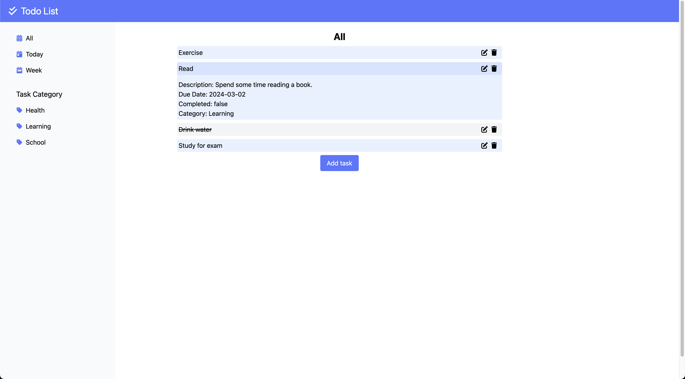
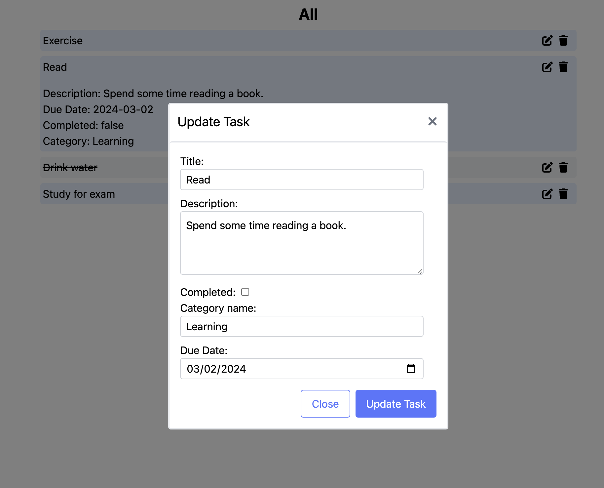
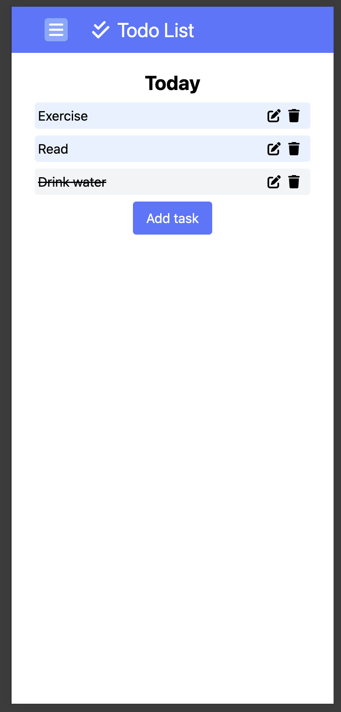
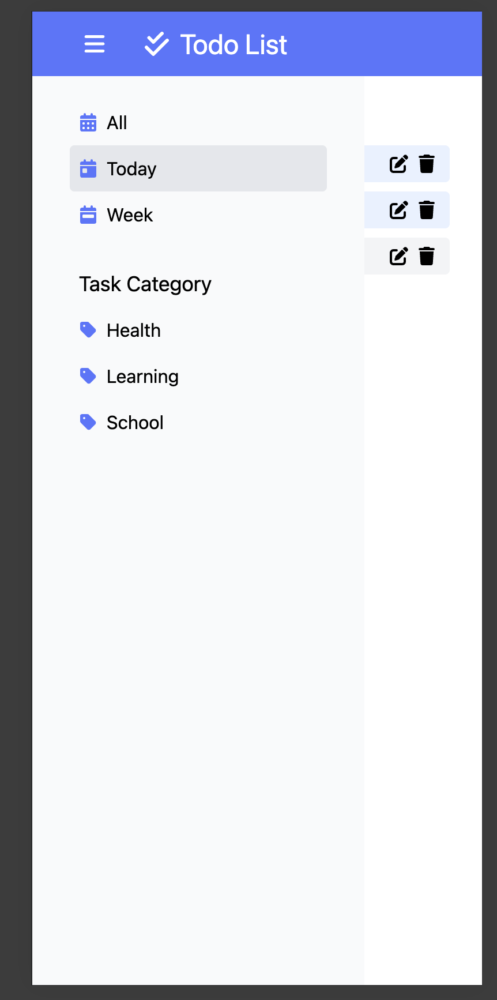
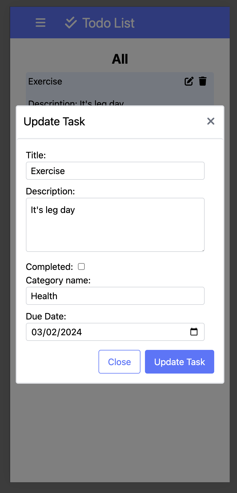

# Todo List

## Overview

This project is a simple todo list application built using React for the frontend and Spring Boot for the backend.

- **Frontend**: The frontend dynamically displays tasks, allowing users to interact with the application by creating, editing, and marking tasks as completed. Tailwind CSS ensures the UI is responsive across devices.

- **Backend**: The Spring Boot backend exposes a RESTful API, handling requests from the frontend. This API facilitates operations such as retrieving, adding, updating, and deleting tasks.

- **Database**: MySQL is used for data storage, with the backend performing database operations to persist task information.

## Features

- Users can create, edit, and delete tasks.
- Tasks are organized by categories.
- Users can mark tasks as completed.
- Responsive design for mobile and desktop.

## Technologies Used

- Frontend:

  - React
  - JavaScript
  - Tailwind CSS

- Backend:

  - Spring Boot
  - Java
    
- Database:
  - MySQL

## Screenshots

More screenshots in the screenshots folder

## Setup

To get the todo list application running locally:

1. **Clone the repository**

2. **Frontend Setup**:

   - Navigate to the frontend directory.
   - Install dependencies: `npm install`
   - Start the development server: `npm run dev`

3. **Backend Setup**:

   - Navigate to the backend directory.
   - Build the project with Maven: `mvn clean install`
   - Start the backend server.

4. **Database Configuration**:

   - Ensure MySQL is running on your machine.
   - Update the `application.properties` file with your database credentials.

5. **Access the Application**:
   - Open your web browser and go to `http://localhost:5173`.
